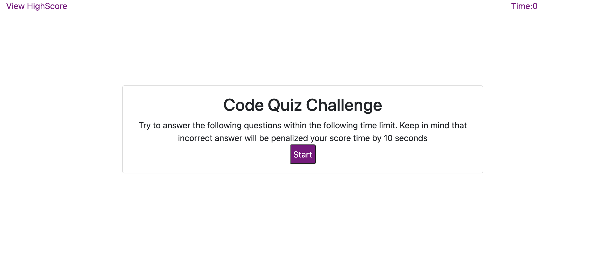
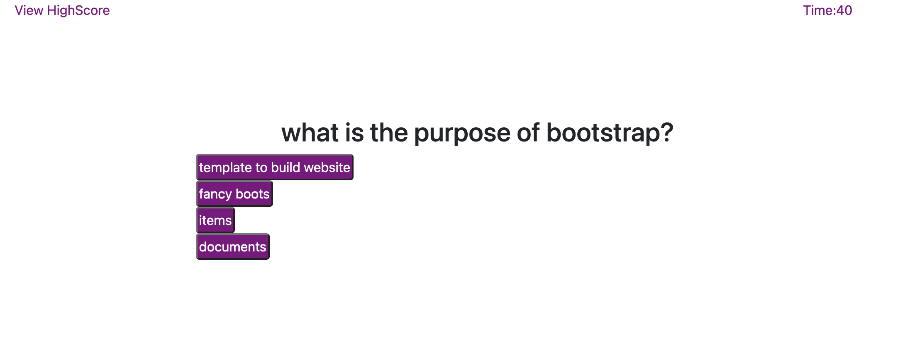
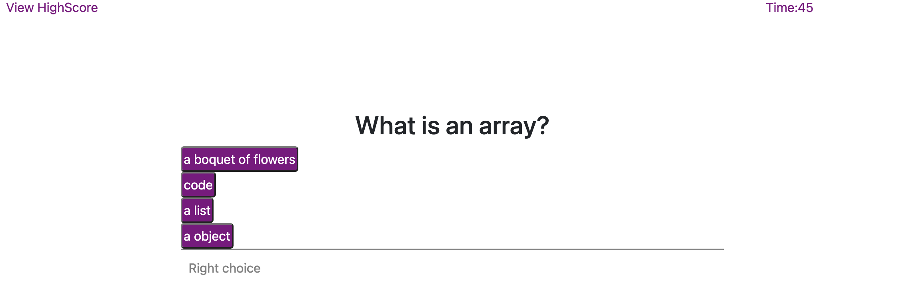
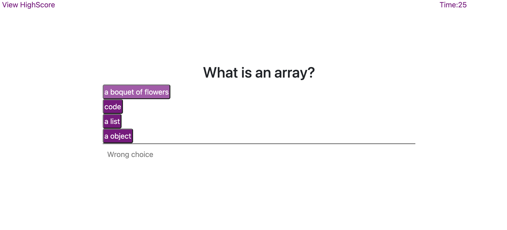
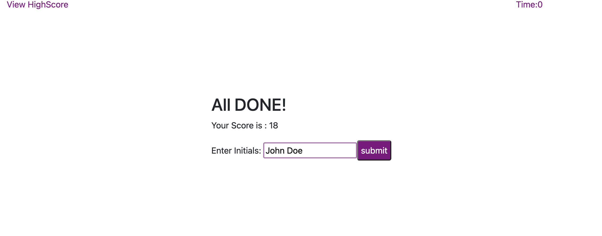
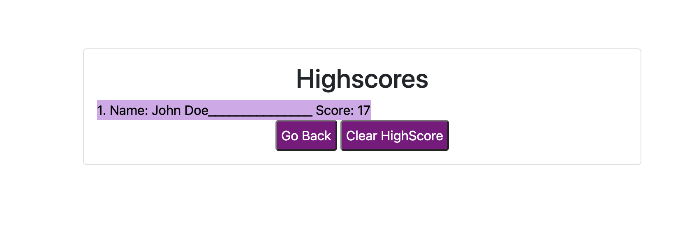

# Homework4
CODE QUIZ!!!

# Summary:
A Timead Quiz used to test knowledge of coding and will be keeping the score of the user. 
Code Quiz will do the following: 
* Have a starting button which will comense the time so

# Usage:
* Multiple choices will appear the user will have to choose one 
* One a choice is made it will change the score based on two things : 
	* Wrong answer will be penalized causing the timer to remove time form the total 
    *  At the end of the quiz the Time will automatically be set to zero that will  be the end of the game. 
* The more time you have at the end of the Quiz the higher the score is.
* This score can be saved and cleared whenever the user chooses. 
* At the end the score of the user will be able to be recorded and be able to clear the score.

# Features:
*  While the the user hovers the question the user will be able to see
 
# Installation:
  There is no installation required for this page, all files can be viewed at the following link:
* https://jacqueline8996.github.io/Homework4/ 
* https://github.com/Jacqueline8996/Homework4.git

* Have a starting button which will commence the time of the Quiz
 
# Images Of App Usage 
* Start Screen of Application

* Demo of the first Question 

* Display of the previous Question Being Right 

* Display of the Previous Question being Wrong 

* User input window 

* Display of the user input 
